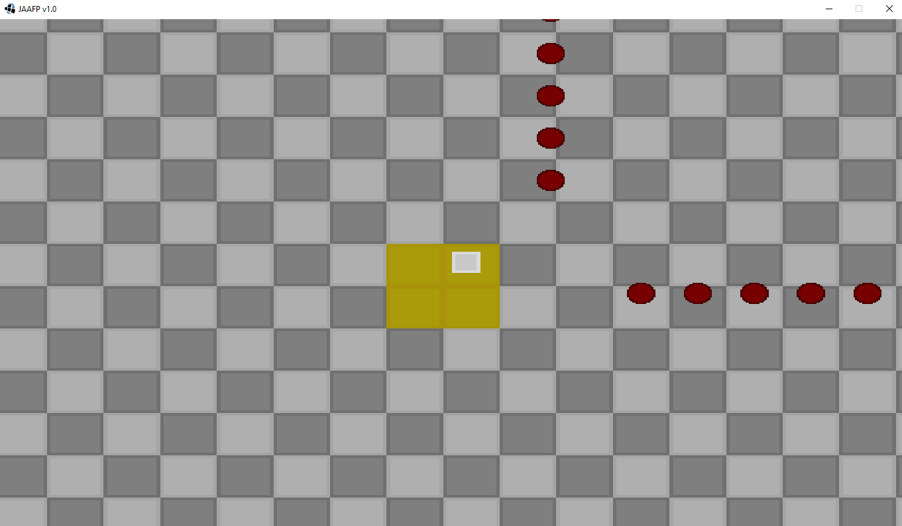
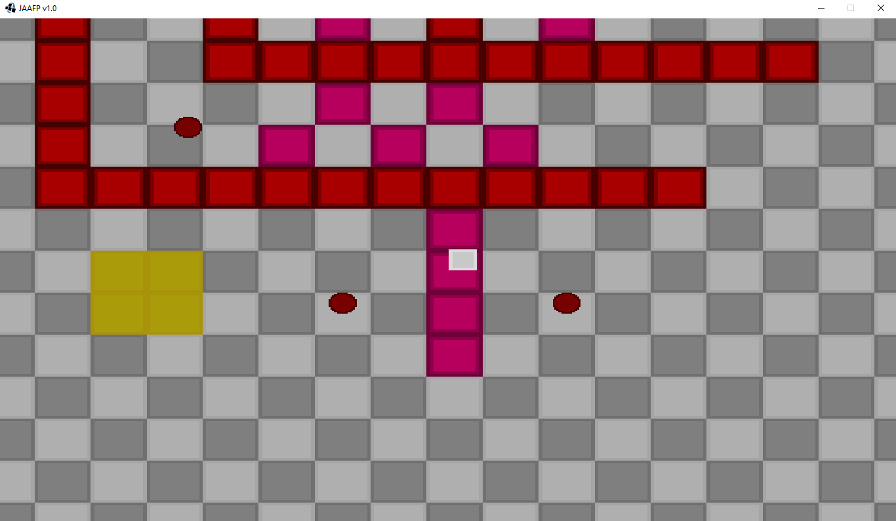
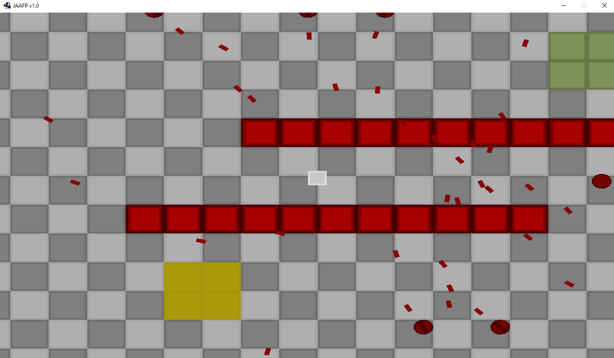
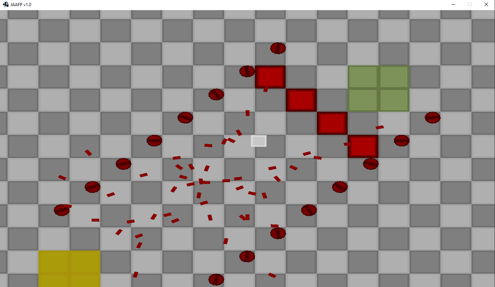

# About The Project

Just Another Annoying F***ing Platformer (JAAFP) is a simple 2D platformer where you need to pass 5 levels to finish the game. 

JAAFP is a perfect example of a libGDX game because it features nearly every aspect of libGDX.  

Such aspects are:
  - tiled maps
  - box2d
  - options (preferences)
  - asset managers
  - sounds & music
  - shaders
  - ...

 

This project also uses my own libgdx extension for better code organization: <a href="https://github.com/oziris78/telek-gdx">telek-gdx</a>

Special thanks to Yunus Emre Çay for helping me with the graphics.

 

### How To Play

- You can play the game by downloading the JAR from the releases section.
- Use WASD keys to move
- Hold SHIFT to run
- Hold SPACE to stop moving.
- If the level is too hard you can press H key to teleport to the end...

 

# Images

 

 

 

 

